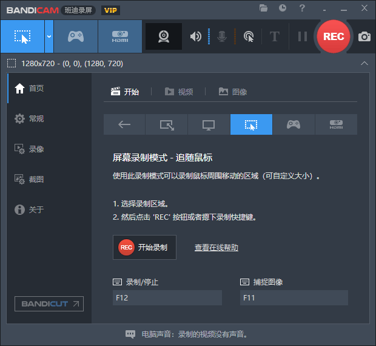
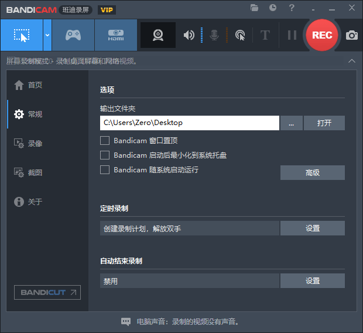

# Bandicam 8.3.1.2537 便携版 

Bandicam (班迪录屏) 是一款功能强大且高效的屏幕录制软件，专为满足各种视频捕获需求而设计，适用于 Windows 系统。凭借其轻量化设计和出色的性能，Bandicam 可用于录制游戏视频、桌面操作、在线课程及网络会议，支持高质量输出并提供多种录制模式。无论是个人用户还是专业内容创作者，Bandicam 都能帮助您轻松录制并创建高品质视频内容。

官方网站：www.bandicam.com

## 截屏

## 功能摘要

1. 屏幕录制
   - 支持全屏、窗口模式或指定区域的屏幕录制，满足多样化的视频录制需求。
2. 高性能游戏录制
   - 专为游戏录制优化，可捕捉 DirectX/OpenGL/Vulkan 渲染的游戏画面，支持 4K 超高清录制和 120 FPS 视频输出，适合制作高质量游戏内容。
3. 网络摄像头录制
   - 支持录制网络摄像头画面，可用于创建教程、直播回放或其他需要人像内容的视频。
4. 设备录制
   - 可录制外部设备（如 Xbox、PlayStation、智能手机、网络摄像头和 IPTV），通过 HDMI 输入捕捉高质量视频信号。
5. 实时绘画工具
   - 在录制过程中支持实时标注、绘画和添加文字，适用于在线课程、教学演示等场景。
6. 小型文件输出
   - 通过先进的压缩算法，在保证画质的同时生成更小的文件，节省存储空间且便于上传与分享。
7. 多格式支持
   - 支持多种视频和音频格式的导出，如 MP4、AVI 等，适应不同播放设备和编辑工具的需求。
8. 定时录制功能
   - 提供计划任务录制功能，用户可设置特定时间自动开始或停止录制，提升效率。
9. 多音轨录制
   - 支持同时录制系统音频和麦克风音频，并提供分离轨道编辑功能，适合后期制作。
10. 硬件加速
    - 集成 NVIDIA CUDA/NVENC、Intel Quick Sync Video 和 AMD VCE 等硬件加速技术，提高录制性能，降低 CPU 资源消耗。
11. 水印和自定义 LOGO
    - 支持添加自定义水印或 LOGO 到录制视频中，适合品牌推广和内容保护需求。
12. 快捷键支持
    - 提供灵活的快捷键设置，方便用户快速操作，提高录制效率。
13. 截图功能
    - 可轻松截取屏幕画面，支持保存为 BMP、PNG 或 JPG 格式，用于文档或演示材料制作。
14. 视频实时预览
    - 在录制完成后可直接预览视频，快速检查并确认录制效果。
15. 多语言支持
    - 提供多语言用户界面，适合全球用户使用，提升软件的易用性和普及度。

## **下载地址**

[**Bandicam 8.3.1.2537 便携版**](https://raw.githubusercontent.com/vtechdot/bandicam/refs/heads/main/Bandicam.8.3.1.2537.Portable.7z)

